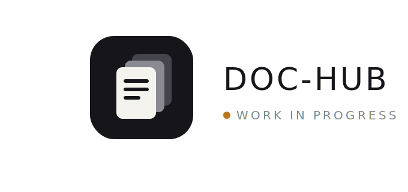

<div align="center">



**Open-source, self-hosted document hub — an encrypted, tamper-evident registry for the documents your team can't afford to lose or leak.**

`.docx` · `.xlsx` · `.pdf` · `.md` · `.txt` · `.csv` · `.json` · `.yaml` — edited natively in the browser, versioned forever, encrypted at rest, searchable by content.

[](./CHANGELOG.md)
[](./.github/workflows/ci.yml)
[](./LICENSE)
[](https://www.rust-lang.org/)

[Live demo](https://doc-hub.casualoffice.org/demo) &nbsp;·&nbsp; [Docs](https://doc-hub.casualoffice.org/docs/install) &nbsp;·&nbsp; [Architecture](./docs/ARCHITECTURE.md) &nbsp;·&nbsp; [Runbook](./docs/ops/RUNBOOK.md) &nbsp;·&nbsp; [Testing](./docs/TESTING.md) &nbsp;·&nbsp; [Plan](./PLAN.md)

</div>

> ### 🚧 Early days — 0.0.1
> **Doc-Hub is being rebuilt from Casual Drive.** The foundations have shipped: `0.0.1` is tagged and published as a container image (`casualoffice/dochub`) with encryption, immutable hash-chained history, the documents-only ingest gate, and the two-origin model all in place and tested. Later phases (native co-editing, full AI layer, compliance workflows) are still in progress — track them in **[ROADMAP.md](./ROADMAP.md)** and the **[project board](https://github.com/orgs/CasualOffice/projects/1)**. Some product URLs and demo links describe the *target* and may not be live yet.

---

**Doc-Hub** is the CasualOffice Document Hub: not a place to dump files, but a place to *keep* them — with a history you can prove, an audit trail you can't rewrite, and encryption you control on your own server.

It is built around four promises:

1. **History is permanent.** Every save appends a new, hash-chained version. Old versions are never overwritten and never hard-deleted — only tombstoned under retention rules. The chain is tamper-evident: alter any past byte and verification fails. This is a registry, not a folder.
2. **Documents are encrypted.** Every file is encrypted at rest (AES-256-GCM envelope encryption, per-workspace keys) and in transit (TLS). A stolen disk or database dump is ciphertext.
3. **Editing is native.** Click a `.xlsx` and it opens in the embedded [Casual Sheet](https://github.com/CasualOffice/sheets); a `.docx` in [Casual Docs](https://github.com/CasualOffice/docs); a `.pdf` in Casual PDF — inside the hub, with real-time co-editing. One app, not a launcher.
4. **Everything is findable.** Full-text search reads *inside* documents (not just filenames), backed by the Rust [`core`](https://github.com/schnsrw/core) extraction engine and a Tantivy index — with an optional AI layer for semantic search, summaries, and cross-document questions.

Documents only. No video, no disk-image dumps, no "put anything here." The narrow scope is the point: it lets us encrypt everything, index everything, and version everything without compromise.

## Who it's for

Teams and individuals who need documents to be **owned, accountable, and durable**: maintainers and registrars keeping an authoritative record, compliance and legal teams who must prove what changed and when, and anyone who wants a private, DigiLocker-style locker for their personal and professional papers — self-hosted, on their own server.

## Quickstart

```bash
docker run -d --name hub \
  -p 8080:8080 \
  -v $HOME/dochub-data:/data \
  -e DOCHUB_BIND=0.0.0.0:8080 \
  -e DOCHUB_APP_ORIGIN=https://hub.your-server \
  -e DOCHUB_USERCONTENT_ORIGIN=https://usercontent-doc-hub.your-server \
  -e DOCHUB_STORAGE_BACKEND=fs \
  -e DOCHUB_FS_ROOT=/data \
  -e DOCHUB_MASTER_KEY=<32-byte base64 KEK> \
  casualoffice/dochub:latest
```

Visit `https://hub.your-server`, complete the one-time admin setup, create a project, upload a document, edit it, and watch the version chain grow. Full env-var matrix at <https://doc-hub.casualoffice.org/docs/configuration>.

## Full stack in one command

The canonical `docker-compose.yml` brings up the **whole** stack — Drive + the
collab gateway + object storage — so both `.docx` and `.xlsx` get real
co-editing:

```bash
cp .env.example .env      # optional: override the shared secret + collab URLs
docker compose up -d --build
```

Services:

| Service | What | Host port |
|---|---|---|
| `dochub` | Drive: SPA + JSON API + WOPI host (Rust) | `8080` |
| `collab` | `casualoffice/docs:v0.0.5` in gateway mode (Hocuspocus/Yjs). Format-agnostic — one service brokers **both** `.docx` and `.xlsx` rooms. | `8082` |
| `minio` | S3-compatible object storage (bucket `drive-dev`) | `9000` / `9001` |
| `minio-init` | one-shot bucket creation | — |

Open <http://localhost:8080>, sign in, and edit a document. The collab gateway
validates Drive's per-file editor token because its `CASUAL_JWT_SECRET` is wired
to the same value as Drive's `DOCHUB_WOPI_HMAC_SECRET` (single `.env` var).

**Two collab URLs, one gateway.** Both `DOCHUB_COLLAB_URL` and the SPA build-arg
`VITE_DRIVE_COLLAB_BACKEND_URL` point at the host-published gateway on `:8082`.
This is deliberate: `DOCHUB_COLLAB_URL` is not a URL the backend dials — Drive
only reflects it into the room `ws_url` it returns to the *browser*
(`collab_ws_url` in `crates/dochub-http/src/collab.rs`), so it must be
browser-reachable, never compose-internal DNS. In `inline` gateway mode there is
no seed/snapshot callback, so no compose-internal collab URL is needed at all.

This canonical file supersedes the older `docker-compose.dev.yml` +
`docker-compose.coedit.yml` overlay dance (kept for reference). It pins the
**published** `casualoffice/docs` image rather than building an ad-hoc gateway
from a sibling repo.

> Co-editing is fully verified end-to-end once the web app wires the SDK's
> collab prop on its `.docx` / `.xlsx` direct mounts (a later phase). Until
> then the gateway is live and brokers rooms; the plain-text editor already
> binds to it, and the SDK editors consume the room for presence.

## What it does

| Surface | Feature |
|---|---|
| **Doc-Hub** | Projects & folders of documents, content-aware search, sort, drag-to-upload, multi-select, breadcrumbs. Documents-only MIME allowlist enforced on every ingest. |
| **Immutable history** | Every version retained, hash-chained, verifiable. Restore any prior version (as a new version — nothing is destroyed), diff versions, export the provenance chain. |
| **Native editing** | Embedded Casual Sheet / Docs / PDF / Markdown editors with built-in real-time co-editing. Bytes decrypt into the editor; saves append a new version. |
| **Encryption** | AES-256-GCM envelope encryption at rest, per-workspace data keys wrapped by a master KEK (or external KMS). TLS in transit. Encrypted BYO-bucket credentials. |
| **Projects & teams** | Personal locker + Team projects with Owner/Admin/Member roles, magic-link invitations, atomic ownership transfer. |
| **Compliance** | Append-only, hash-chained audit log; retention policies; legal hold; document signing/provenance; exportable audit & retention reports. |
| **Search + AI** | Full-text content search over every format via `core` + Tantivy. Optional AI layer: semantic search, summaries, entity/PII detection, cross-document Q&A (pluggable provider; local-model option for air-gapped installs). |
| **Sharing** | Per-document share links with optional password (Argon2id) and expiry, on an isolated user-content origin. |
| **Auth** | Argon2id passwords + OIDC (Authorization Code + PKCE) against any compliant IdP. |
| **Self-host** | Single Rust binary, one Docker container, SQLite for a $5 VPS or Postgres + S3/MinIO/R2/B2 for scale. |

## What it is not

- Not general cloud storage or a Drive/Dropbox clone — documents only, no heavy/binary blobs.
- Not zero-knowledge E2E — the server holds keys so it can index and reason over content. It defeats a stolen disk/DB, not a fully compromised trusted server (see [Security model](./docs/research/06-security.md)).
- Not a media library, sync client, or mailbox.

## Repo layout

```
dochub/
  crates/                Production Rust workspace
    dochub-core/          Domain types, Config, errors
    dochub-db/            SQLx repos + migrations (SQLite + Postgres portable)
    dochub-storage/       OpenDAL facade + at-rest encryption layer, BYO secret envelope
    dochub-crypto/        Envelope encryption, key wrapping, hash-chain + provenance
    dochub-index/         core-backed text extraction → Tantivy full-text index
    dochub-ai/            Optional AI layer (semantic search, summaries, PII, Q&A)
    dochub-auth/          Sessions, Argon2id, OIDC, share links
    dochub-http/          Axum router, two-origin middleware, every API surface
    dochub-bin/           Binary entry point
  web/                   React SPA (embedded editors), embedded into the binary via rust-embed
  marketing/             Astro 5 site (doc-hub.casualoffice.org) + the /demo SPA
  docs/
    ARCHITECTURE.md      System architecture
    TESTING.md           Test strategy: unit + integration + property + e2e/use-cases
    ops/RUNBOOK.md       Day-2 operations: deploy, monitor, back up, restore, rotate keys
    research/            Grounded research briefs + synthesis
    ux/                  Surface specs and numbered flows
  PLAN.md                Phased delivery plan + current status
  CLAUDE.md              Working rules for contributors and AI assistants
```

> **Naming/transition note:** the product is being revamped from "Casual Drive" (a storage Drive) into Doc-Hub. Crate/env names shown here (`dochub-*`, `DOCHUB_*`) are the target; the tree may still carry `drive-*` / `DRIVE_*` until the rename lands. See [`PLAN.md`](./PLAN.md) Phase 0.

## Build + dev loop

```bash
cargo run -p dochub                     # Rust binary on :8080
cd web && pnpm install && pnpm dev     # SPA dev server (HMR; proxies /api)
cd marketing && pnpm install && pnpm dev
```

Required env is documented in `.env.example` and on the docs site.

## Quality bar

This is a production-grade, compliance-oriented project. Every PR must pass the CI gates and carry tests for new behaviour — unit, integration, and, for user-facing flows, an end-to-end use-case test. Crypto and immutability invariants carry property tests. See [`docs/TESTING.md`](./docs/TESTING.md).

```
cargo fmt --check
cargo clippy --workspace -- -Dwarnings
cargo test --workspace          # unit + integration
cargo test --workspace --features proptest   # property tests
cargo audit --deny warnings
cargo deny check
pnpm --dir web test             # component/unit
pnpm --dir web test:e2e         # Playwright use-cases
```

## Contributing

1. Read [`CLAUDE.md`](./CLAUDE.md) — the inviolable rules + locked decisions.
2. Read the relevant `docs/research/` brief and `docs/ux/` surface before touching an area.
3. Open an issue before a PR. PRs must pass CI and ship tests.

## License

Apache-2.0 — see [`LICENSE`](./LICENSE) and [`NOTICE`](./NOTICE).

## Sister projects

- [Casual Sheet](https://github.com/CasualOffice/sheets) · [Casual Docs](https://github.com/CasualOffice/docs) · [Casual PDF](https://github.com/CasualOffice/casual_pdf) · [`core`](https://github.com/schnsrw/core) engine · [Casual Office](https://casualoffice.org)

Doc-Hub is the governance and record-keeping home of the suite; Casual Desktop is the local editing home. Both share the `core` document engine.
